IO流操作一般分为两类：字符流和字节流。以“Reader”结尾都是字符流，操作的都是字符型的数据；以“Stream”结尾的都是字节流，操作的都是byte数据。

# IDEA j 学习

Java SE(Java Platform,Standard Edition)，应该先说这个，因为这个是标准版本。Java EE (Java Platform，Enterprise Edition)，java 的企业版本Java ME(Java Platform，Micro Edition)，java的微型版本。

新版本新特性 2018.1

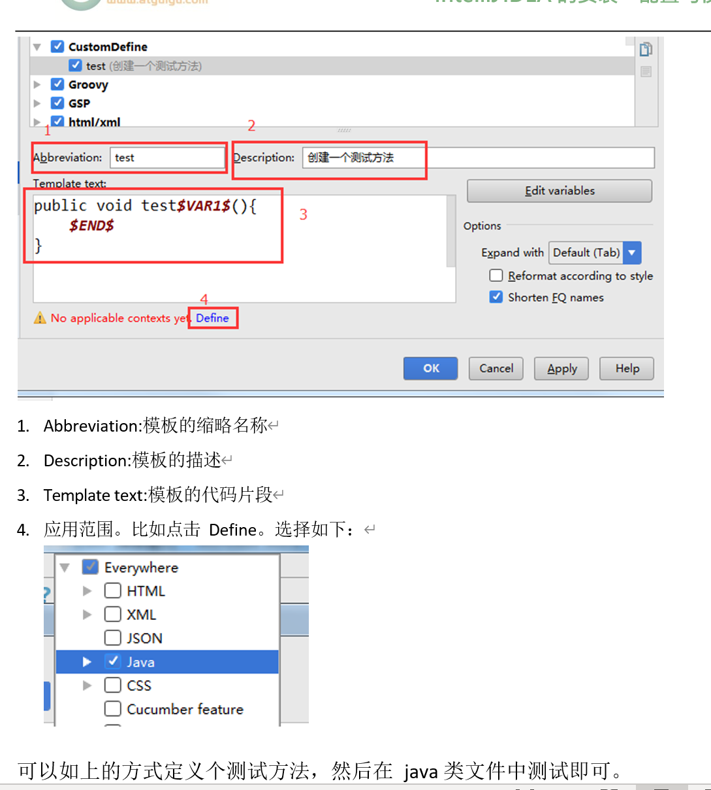

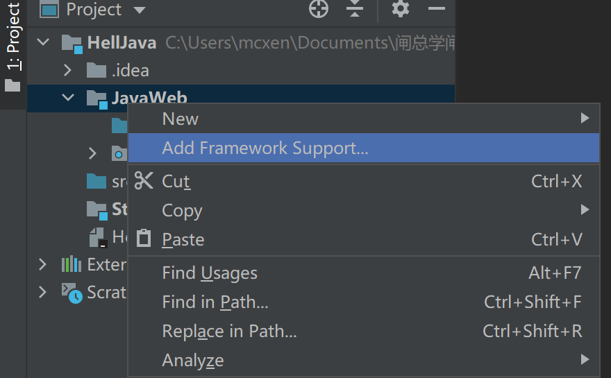

这里是添加FraneWork加入JAVAEE web application

<br/>

<br/>

commit 是本地的提交

push是远程的提交

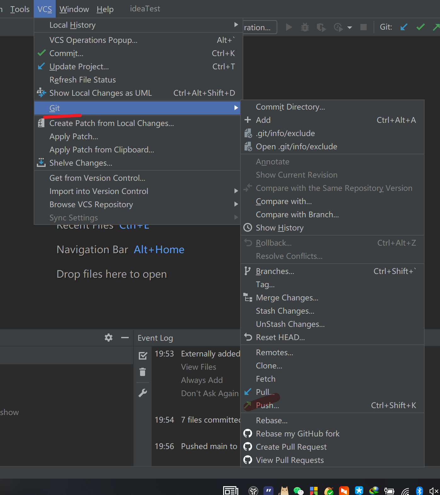

pull是更新到本地

clone 是拷贝远程仓库

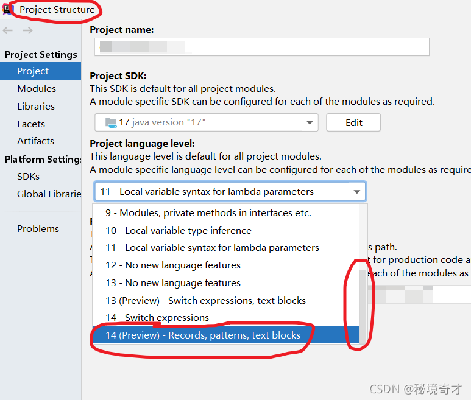

上面是修改JDK的版本

<br/>

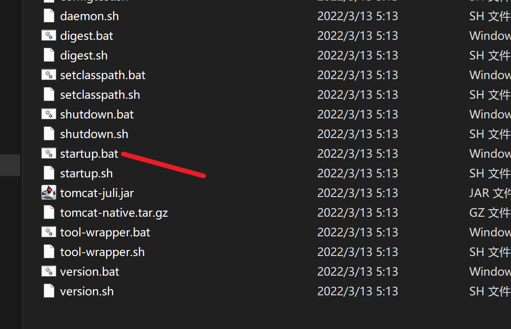

## Tomcat

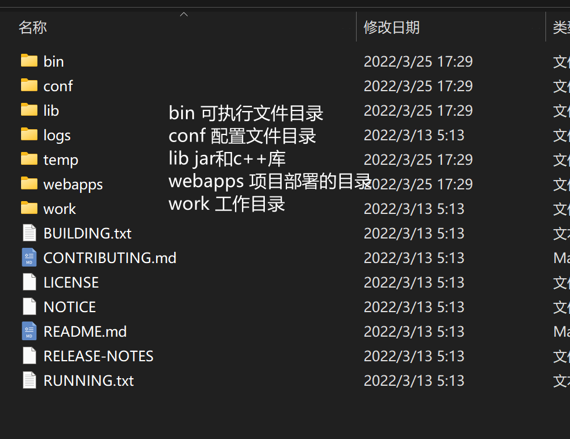

Tomcat的容器要加入WEB-INF

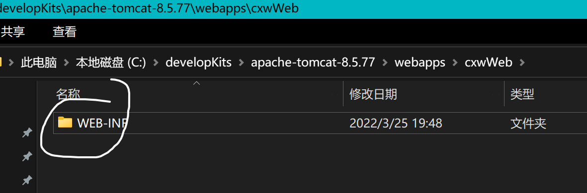

<br/>

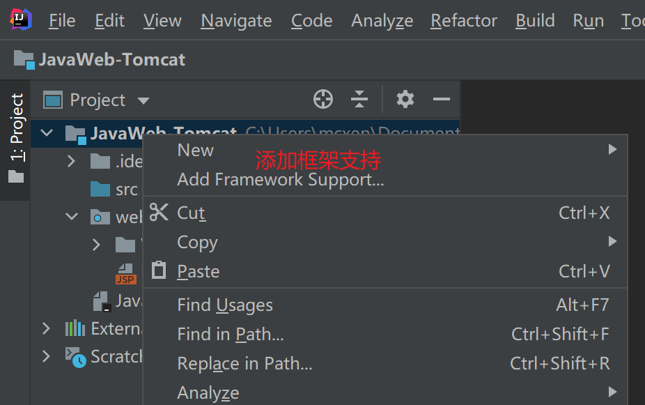

<br/>

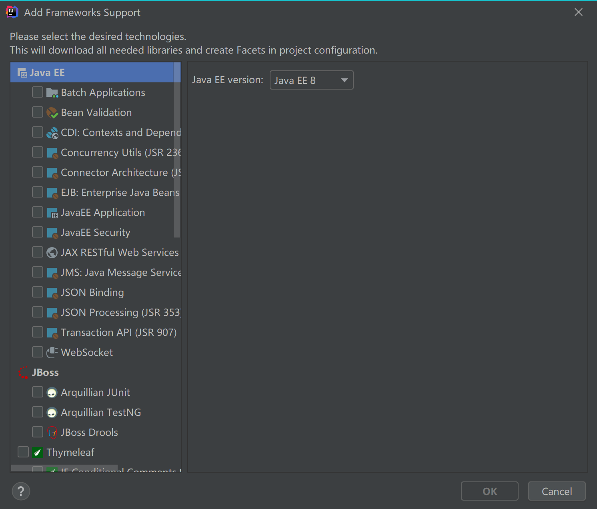

<br/>

<br/>

servlet

功能：获取用户返回的数据

<br/>

<br/>

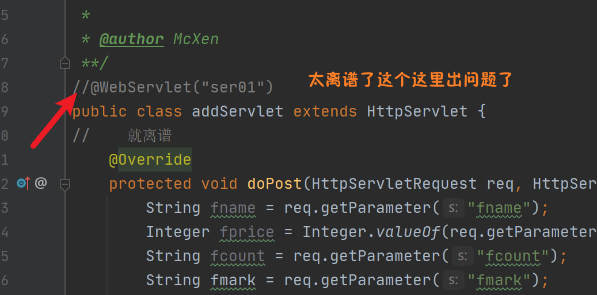

哈哈哈哈哈

我晓得了

上面应该是

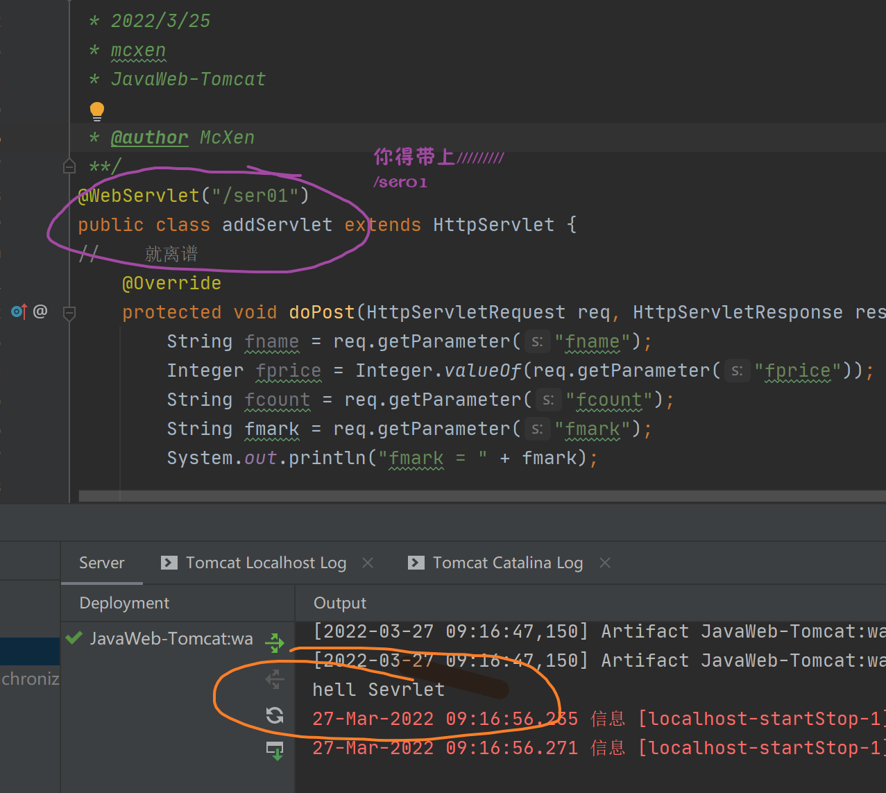

Servlet的注解作为访问的路径

<br/>

@WebSevlet("/ser01")

<br/>

<br/>

## HttpServlet

### HttpServletRequest

对象由Tomcat自动创建

我们掌握常用方法就可以了

```java
        //        Methods
//        获取请求的完整路径 从Http到？前面结束
        String url = String.valueOf(req.getRequestURL());
        System.out.println("url = " + url);
//        获取请求的部分路径从项目的站点名到？前面结束
        String uri = req.getRequestURI();
        System.out.println("uri = " + uri);
//        获取请求的参数字符串 从？到最后的字符串
        String queryString = req.getQueryString();
        System.out.println("获取请求的参数字符串 queryString = " + queryString);
//        获取请求方式
        String method = req.getMethod();
        System.out.println("获取请求方式 method = " + method);
//        获取当前协议版本
        String protocol = req.getProtocol();
        System.out.println("获取当前协议版本 protocol = " + protocol);
//        获取项目站点名
        String contextPath = req.getContextPath();
//        上下文路径
        System.out.println("获取项目站点名  contextPath = " + contextPath);
```

<%--    post请求会乱码--%>

```java
/**
         * 获取请求的参数
         * *****
         * 最重要的方法
         */
//        获取指定名称的参数值
        String uname = req.getParameter("uname");
        System.out.println("uname = " + uname);
        String pwd = req.getParameter("pwd");
        System.out.println("pwd = " + pwd);
//        获取指定名称的所有的参数值
        String[] hobbys =req.getParameterValues("hobby");
        for (String hobby : hobbys) {
            System.out.println("爱好是 "+hobby);
        }
```

请求转发 

就是getRequestDispatcher("url servlet名称").forward(req,resp);转发一个参数

```java
protected void service(HttpServletRequest req, HttpServletResponse resp) throws ServletException, IOException {
        String uname = req.getParameter("uname");
        System.out.println("这里是Dispatch");
//        req.getRequestDispatcher("serReq01").forward(req,resp);
//        req.getRequestDispatcher("login.jsp").forward(req,resp);
        req.getRequestDispatcher("hell.jsp").forward(req,resp);
    }
```

Dispacher

<br/>

域对象:

```java
         */
//        设置域对象内容
        req.setAttribute("name","admin");
        req.setAttribute("age",18);
        ArrayList<String> list = new ArrayList<>();
        list.add("aaa");
        list.add("bbb");
        req.setAttribute("list",list);//添加List
//        请求转发跳转到servletAttribute
        req.getRequestDispatcher("hell.jsp").forward(req,resp);
```

域对象: 就是一个代码块向另一个传送数据

```

```

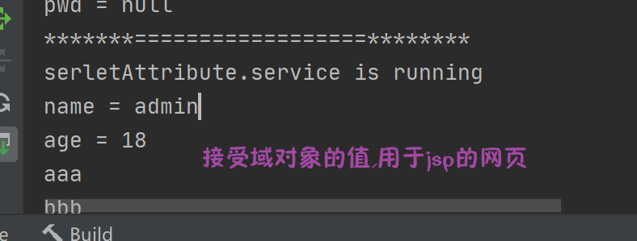

<br/>

## Response 

两个方式

- getwrite
- 
